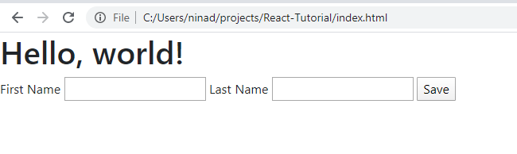
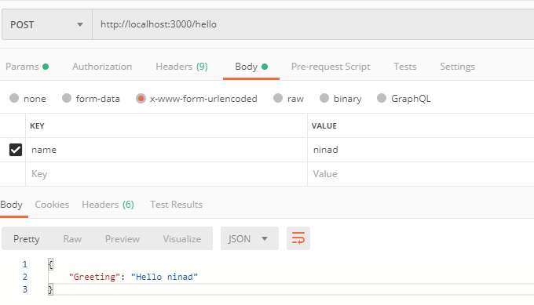

# 0-1 React Tutorial
The following tutorial should help in everything from basic knowledge of forms until the deployment phase.\
[Click Here, for the PPT.](http://bit.ly/2w8iCYc)

# Steps
1. Create a Static page in HTML/Bootstrap.
1. Create scaffolds for Server and client apps. Can just copy the folders & files already in this repo!Try starting both the server and client.
1. Add your html page you added in step 1 into your react app.
1. Deploy to EC2.
1. Add an API in your application which accepts name and description and saves it to the Database. Then test this API
1. Redeploy! and check if it works online!
1. Add API in the server which accepts a username and a password and returns {"Auth": "Success"} as Output (Refer to the section about addition api)
1. Consume that API in the client-side ReactJS app. (Refer to the section where making a simple addition API is discussed)
1. Create a form which has inputs for name, description & sends the data to the previously developed API.
1. Modify reactJS component such that the form mentioned in earlier step is only visible when the user has successfully logged in. ( Use conditional rendering)
1. Test if saving name and decription works now!

# Videos
1. (Lecture  3/31)[https://livealbany-my.sharepoint.com/:u:/g/personal/nchaudhari_albany_edu/ETcpKEXDczVKoOxPb8VnO8cBFiceqYc4qCtu3jpu2FVxuQ?e=tNtWrU]
# Basic forms

## Very basic form
First this is a simple Hello world HTML page
```html
<!doctype html>
<html lang="en">
  <head>
    <!-- Required meta tags -->
    <meta charset="utf-8">
    <meta name="viewport" content="width=device-width, initial-scale=1, shrink-to-fit=no">

    <!-- Bootstrap CSS -->
    <link rel="stylesheet" href="https://stackpath.bootstrapcdn.com/bootstrap/4.4.1/css/bootstrap.min.css" integrity="sha384-Vkoo8x4CGsO3+Hhxv8T/Q5PaXtkKtu6ug5TOeNV6gBiFeWPGFN9MuhOf23Q9Ifjh" crossorigin="anonymous">

    <title>Hello, world!</title>
  </head>
  <body>
    <h1>Hello, world!</h1>

    <!-- Optional JavaScript -->
    <!-- jQuery first, then Popper.js, then Bootstrap JS -->
    <script src="https://code.jquery.com/jquery-3.4.1.slim.min.js" integrity="sha384-J6qa4849blE2+poT4WnyKhv5vZF5SrPo0iEjwBvKU7imGFAV0wwj1yYfoRSJoZ+n" crossorigin="anonymous"></script>
    <script src="https://cdn.jsdelivr.net/npm/popper.js@1.16.0/dist/umd/popper.min.js" integrity="sha384-Q6E9RHvbIyZFJoft+2mJbHaEWldlvI9IOYy5n3zV9zzTtmI3UksdQRVvoxMfooAo" crossorigin="anonymous"></script>
    <script src="https://stackpath.bootstrapcdn.com/bootstrap/4.4.1/js/bootstrap.min.js" integrity="sha384-wfSDF2E50Y2D1uUdj0O3uMBJnjuUD4Ih7YwaYd1iqfktj0Uod8GCExl3Og8ifwB6" crossorigin="anonymous"></script>
  </body>
</html>
```

Now consider, we have to ask user to enter *Name*. We can add the following inside the *body* tag : 
```html
<form action="/endpoint" method="post">
    <label for="firstName">First Name</label>
    <input type="text" name="firstName" id="firstName">

    <label for="lastName">Last Name</label>
    <input type="text" name="lastName" id="lastName">

    <input type="submit" value="Save">
</form>
```
This would result in the follwing html. \


The user can fill in the information and click on "Save" when done. 

> now, What happens when this button is pressed?\
The browser sends the form data to the endpoint specified in the `action` parameter of the form.

There are times when this behaviour is not enough, we might have to perform some sanity check before sending the data to the backend. Hence we can intercept this action of the browser sending data to the server using Javascript.\
For Eg. I need to alert the user with firstName,lastName What can be done is, we can add the following script tag after we load jQuery.
```javascript
<script>

    $(document).ready(function () {

      $("#firstForm").on('submit', function (e) {
        e.preventDefault(); //prevent submit

        //Access Form info
        myFormObject = new FormData(document.getElementById("firstForm")); 
        alert("you enetered " + 
        myFormObject.get('firstName') + ", " + 
        myFormObject.get('lastName'));
      });

    });

  </script>
```
Now since we know how to intercept the default behaviour of the form, we can use it to modify the form object to suit our needs, THEN send the POST / GET request via JavaScript. 
<details>
<summary> References </summary>

[Firefox refernce on FormData Object](https://developer.mozilla.org/en-US/docs/Web/API/FormData)
[Using Jquery to send a AJAX query](https://stackoverflow.com/questions/21044798/how-to-use-formdata-for-ajax-file-upload)
</details>

# Basics of JavaScript
1. Controlling ASync function calls.\
* JS is single thereaded, blocking & Synchronous. It SUPPORTS async behaviour.(i.e. some functions are defined as async)
* It essentially has an execution stack and an event queue.
* Things are added to this execution stack, but messages can be left into the event queue in async way.
* The job of the Event loop is to look into the call stack and determine if the call stack is empty or not. If the call stack is empty, it looks into the message queue to see if there’s any pending callback waiting to be executed.
Unlike other languages, if 2 function calls are made after each other,
Function callback is a process of one function calling the other function once the first function is done it's job. We can use Callbacks or Promises to sync function calls. \\

Essentially, when we call an external API / make a DB call, it does not make sense for a language to keep the function on the top of the execution stack. Hence instead of keeping it in the top of the stack, we have the power to instruct browser engine / nodejs to put a message in the event queue once it is done fetching the DB or api call.


2. Promises\
Promises can be used to make async code synced. [Here](https://stackoverflow.com/questions/40029867/trying-to-implement-a-simple-promise-in-reactjs) is a good answer for using Promises with ReactJS.

3. Variables, Functions & Es6 syntax.
varibles can be declared in various ways. You can use `var, let or const` keywords to declare a variable. They differ by the scope. `var` has function scope, `let` & `const` have block scope. As name might suggest a `const` creates immutable variables.

ES6 classes can be used to delcare classes in JS. You can have inheritance in ES6 classes. A good example for everything in these classes : [es6 class sample](https://googlechrome.github.io/samples/classes-es6/)\

You can declare functions using the `arrow` syntax as well. These functions are same to the functions declared by using the `function` keyword.\
Eg: These are equavalent 
```javascript
// Function Expression
const doubleEXP = function(num){
  return num * 2;
}
// Arrow Function
const doubleARR = (num) => {
  return num * 2;
}
```

<details>
<summary> References </summary>

[Understanding async javascript](https://blog.bitsrc.io/understanding-asynchronous-javascript-the-event-loop-74cd408419ff)\
[When is JS async](https://stackoverflow.com/questions/2035645/when-is-javascript-synchronous)\
[What the hell is a promise](https://medium.com/better-programming/is-javascript-synchronous-or-asynchronous-what-the-hell-is-a-promise-7aa9dd8f3bfb)

[var, let & const](https://stackoverflow.com/questions/21237105/const-in-javascript-when-to-use-it-and-is-it-necessary)\
[Arrow Functions](https://codeburst.io/javascript-understand-arrow-function-syntax-ab4081bba85b)\
[W3Schools - Extreme basic JS reference](https://www.w3schools.com/js/default.asp)
</details>

# Creating a Server

## Your first server.
 Let's create a server. Essentially follow [Expressjs Installation guide](https://expressjs.com/en/starter/installing.html) & [Hello World Guide](https://expressjs.com/en/starter/hello-world.html)

1. cd to a new folder
2. `npm init` to initialize a new NPM project.
3. Hit enter for everything.
4. run `npm install express --save` This will save expressjs as a depedency in your package.json file.
5. Create a file `index.js`

Enter hello world code there 
```javascript
const express = require('express') // IMPORT express
const app = express() // create an instance of the import.
const port = 3000 // variable to store the port to listen on

app.get('/', (req, res) => res.send('Hello World!')) // IF you get a GET on '/' send 'Hello World' as a response'

app.listen(port, () => console.log(`Example app listening on port ${port}!`)) // make app listen on the port.
```
You just created a simple Server. That returns Hello world when you ask '/'! 
Now you can use any of the clients to request this server.

Important highlights : 
* `app.get` => accepts 2 parameters. one the path of the request and other the function to run when the path string is received. In our case the path is root or '/' the function is defined in the `arrow` function format.
* `req,res` => the fuction is passed 2 arguments : `req` corresponds to the request. This object can be used to extract request parameters. `res` defines the modifyable object which will be given as a response. In our case, we are not looking for any vairebles from the request and just sending "Hello World!" as a response.

## Generating Entire skeleton of an app.
You can certainly add everyting, but in general an express app has typical skeleton, we can use generator to scaffold out basic functions. We will use `npx` for this.
1. cd to a new directory
2. run `npx express-generator --view ejs` .This will scaffold an express app.
3. Observe the files.

`app.js` is the start point of the app. It contains basic code to parse requests and imports to indexRoutes and userRoutes. `index.js`(one of the controllers) in routes folder contains the code to be invoked when any request hits the server on root domain. An example flow is :
1. A client hits the "/" endpoint. 
2. The expressJS app parses the input and populates the request information in the `req` variable (1st argument) & a `res` variable(2nd argument). 
3. ExpressJS matches the endpoint to existing routes that any controller (or route ) can serve. 
4. If the match is found, that controller is invoked.
5. The function in this controller is responsible to populate the `res` object which was passed when calling the said function.
6. The response is hence sent to the user.

You can run this using command `npm install` followed by `DEBUG=myapp:* npm start` (unix) or `set DEBUG=myapp:* & npm start` (Windows). Checkout [http://localhost:3000](http://localhost:3000) & [http://localhost:3000/users](http://localhost:3000/users). The logic to be sent in the requests is written in the router defined in `index.js` and `users.js` respectfully. 

## Modifying one of the controllers.
### Hello **name**
We want the server to respond with `Hello <your Name>` when the server receives a POST request on `/hello` i.e. `http://localhost:3000/hello`. let's modify the index.js controller. 

```javascript
router.post('/hello', (req,res)=>{
  res.json({"Greeting" : "Hello " + req.body.name});
});
```
We can call this API from any of the clients. Here is a snip of the postman client. 



We can also call these requests from a Javascript method in HTML file you created. We will use [axios](https://github.com/axios/axios) to do this job in ReactJS app. You can also use the Browser native or any other library to do the ajax call.

### Simple addition API
Consider a simple API where we want the server to give us the result of addition of 2 nos. 
> **Stop** and Think how you would implement this... 

One way is to add the following function in `index.js`:
```javascript
//note, unlike POST, parameters are visible to a user in browser address bar in GET request.
router.get('/add/:firstNumber/and/:secondNumber', (req,res)=>{
  console.log(req.params.firstNumber + req.params.secondNumber);
  //Checkout console to see why parseInt is essential in this case.
  let firstNo = parseInt(req.params.firstNumber),
      secondNo = parseInt(req.params.secondNumber);
  res.json({"Addition" : firstNo + secondNo});
});

```

We could have done this exactly the way we did the previous technique ( using POST request and `res.body`) but this is just another way to demo the `params` attribute. You can see basic routing info on [Express Docs- Routing](https://expressjs.com/en/guide/routing.html)
let's invoke this using other client: your browser. Visit [http://localhost:3000/add/1/and/2](http://localhost:3000/add/1/and/2). 

## Adding DB.
Follow ExpressJS [instructions](https://expressjs.com/en/guide/database-integration.html#mongodb) to add MongoDB.
you do not need to [install mongoDB locally](https://www.mongodb.com/download-center/community) (if you have some storage limitations). You can just use [MongoDB Atlas](https://www.mongodb.com/cloud/atlas) to get a free cloud hosted DB and use the internet to connect to that DB instead of the `localhost:27017` you use in the instructions in that case.

You can use Atlas to save your time as you do not need any steps to install atlas on your EC2 instance too.

Just for reference you can use direct MongoDB queries off Express.
To Insert:
> db.users.insert( { name: "ninad", web : "https://ninadtech.com" } );

To find: 
> db.users.find({name : "ninad"});

To update:
> db.users.updateOne({name : "ninad" , $set: {"web" : "https://ninadpchaudhari.github.io"}})

You can find all the  basic operations on [MongoDB docs](https://docs.mongodb.com/manual/reference/command/) or just google about basic commands.


## Enabling CORS
Cross-Origin Resource Sharing (CORS) is a mechanism that uses additional HTTP headers to tell browsers to give a web application running at one origin, access to selected resources from a different origin. A web application executes a cross-origin HTTP request when it requests a resource that has a different origin (domain, protocol, or port) from its own.
[To allow CORS follow instructions here](https://medium.com/@alexishevia/using-cors-in-express-cac7e29b005b). Basically
> npm install --save cors\
> add `app.use(cors());` in `app.js`
<details>
<summary>Express References </summary>
[Express Routing-easy](https://expressjs.com/en/starter/basic-routing.html)\
[Express routing-docs](https://expressjs.com/en/guide/routing.html)

[More Info on CORS](https://developer.mozilla.org/en-US/docs/Web/HTTP/CORS)
</details>

# Exploring React.
>Find "Motivation" in slides

First of all, we should understand the fact that: web apps are written in Javascript and HTML/CSS is just a technology that acts as a `View` or templates and styles which JS can change anytime.

 I was going to expand on getting started with ReactJS here, but [this](https://www.taniarascia.com/getting-started-with-react/) article by Tania Rascia explans it very well. Please give it a read at-least until the section of "JSX".
 
 I recommend the ["Main Concepts" section](https://reactjs.org/docs/hello-world.html) of docs. Skip the advanced concepts like Lifting State up (chapter 10).

 Another wonderful resource is the [w3school tutorial](https://www.w3schools.com/react/default.asp) Follow, read and understand each line till "lifecycle".

 For our Assignment, you can just use `npx` method to create a front-end app. You could have a single component or can make 3 components navbar, profile page and then the admin page. Then render them based on if the user is logged in.

 Glance over [Thinking in React](https://reactjs.org/docs/thinking-in-react.html) If you are a little comfortable after the previous articles and a small app.

### To Summarize:
* A react app is a collection of components.
* Each component can optionally have memory (called state).
* Each component has to have a `render` method, which is responsible to act as a `View` to show something on the UI.
* Imagine each component being refreshed everytime you update the `state`.
* if you wish to run something before the component is mounted, use the specific lifecycle method.
* Checkout [w3schools-forms](https://www.w3schools.com/react/react_forms.asp). They have an example on how to invoke a specific method on submit.
* You can use [axios-tutorial](https://daveceddia.com/ajax-requests-in-react/) or use the built in `fetch` as explained by tania.
* You can import the `div containers` from bootstrap to react by copying them to the `render` method.

## Your first component.
I am going to be brief here assuming you have read the links earlier. cd to the project directory, then this command will create a new client-side project in the folder `my-client`, then I am clearing all the files in src. Then adding bootstrap to the project.
> npx create-react-app my-client\
> cd my-client/src && rm -f * && cd ..\
> npm install --save bootstrap

Now, starting form scratch, Adding just 1 file : `index.js` in the src directory. Adding required imports and creating a component.
```javascript
import React from 'react';
import ReactDOM from 'react-dom'; 
import 'bootstrap/dist/css/bootstrap.css';
class MyFirstComponent extends React.Component{
    render(){
        return (
            <h1>Hello! 
              <small className="text-muted">With faded secondary world!</small>
            </h1> 
        );
    }
}

```
*Note now : We have just 1 file in the project source! \
Just One JS file.* We are developing for web without focusing on HTML. This JS component happens to have a method that returns a JSX expression (something like HTML). \
*Also*, I am using bootstrap classes using `className` instead of just `class`. React compiles this for you. This is required for JSX. Read references if you have the curiosity for why.

This component can be rendered into a place, which we will provide the markup for in the `index.html` ( We just have one div there with ID = root, which are using as a first rendering target -- checkout index.html).Then add the following code to index.js to make it render the `MyFirstComponent` into the division with id=`root`\
> ReactDOM.render(<MyFirstComponent />, document.getElementById("root"));

### Running this simple app.
> npm start\
> Visit  [http://localhost:3000](http://localhost:3000)

note: as you make changes in code, the same is auto reflected to your browser.

### Syntax for setState.
Please read about state. It is a bunch of variables a component can store. You update variables in state by calling the `.setState(Object)` method. It takes a Object as a parameter the syntax is : {<Var to update> : <The value>} Checkout the way W3c School's form handling for reference or my addition form.
  
## Consuming the Addition API we saw previously
please refer to the [w3school forms](https://www.w3schools.com/react/react_forms.asp) for more info. Before we begin, I am copying `my-client` into a folder `my-addition-client` so the previous section can be reffered.
### My plan is such : 
1. Create a new component named `MyAdditionForm` in a seperate file.
2. Write code to update this component's `state` when user makes any change.
3. Write code to call the backend addition api using built in `fetch`.
4. Write code to display the result.
5. Export the same as a `module` and import into the `index.js` file.
6. Use this new component inside the `MyFirstComponent` just to demo that one component can be inside the other, without affecting much.
7. Make expressjs listen on port `9000` and start it. As only one process can listen to one port at one time, this is important. **`DEBUG=myapp:* PORT=9000 npm start`**
8. Test out my react app.

Note: Usually for complex UI components, you can develop the HTML in seperate file, modify layout/style etc, then import into the app's render method. You do not need to export and import the way I am doing in point 2, you can just create the component in same file. I am doing it to make it easier to read.

# S3 Integration
>Find "Motivation" in slides
I have modified code by mohamed Kheliif in the tutorial [Uploading files from a React app to AWS the right way](https://medium.com/@khelif96/uploading-files-from-a-react-app-to-aws-s3-the-right-way-541dd6be689). You can checkout the article for explanation, I have modified files to make sure they run in 2020 and have added files in project files.
## Configure AWS.

1. Download *Access Keys*
   1. Sign into Console.
   2. Click on *Your name* on right top.
   3. Select `My Security Crednetials`
   4. Click on `Access Keys`
   5. Click `Create new access key`
   6. Open the CSV file. Note the **AWSSecretKey** and **AWSAccessKeyId**.
2. Create a new S3 bucket, 
   1. Search for S3 in AWS console.
   2. Click on `new`
   3. give a dnc compliant name for your bucket.
   4. Next... until you reach `Block public access`. 
   5. Untick  `Block all public access` and accept the `acknowledgment`
3. Modify the bucket to allow writes and public reads.
   1. Click on the bucket you created earlier
   2. Click on the `Permissions` tab.
   3. Goto the `CORS` Configuration.
   4. Enter
```xml
<CORSConfiguration>
  <CORSRule>
     <AllowedOrigin>*</AllowedOrigin>
     <AllowedMethod>GET</AllowedMethod>
     <AllowedMethod>POST</AllowedMethod>
     <AllowedMethod>PUT</AllowedMethod>
     <AllowedHeader>*</AllowedHeader>
  </CORSRule>
</CORSConfiguration>
```
   5. Click `Save` 

## Configure Server.
### Checkout folder : `server-s3`
1. add `.env` file to `.gitignore`
2. create a new file `.env` in your server directory (same level as app.js).
3. Configure your app to read this file `require('dotenv').config();`
4. Populate the keys with your info from CSV file
   ```
   AWSAccessKeyId=YourKey
   AWSSecretKey=YourSecret
   bucket=YourBucketName
   ```
5. Checkout the file `awsCtrl.js`. You can just use the same code.
6. use this new controller in the app : `app.use('/sign_s3', awsCtrl);`.
7. You can test this new api avaliable at `/sign_s3` in postman, by calling a *POST* request with `fileName` and `fileType` in request body.

## Configure Client
### Checkout folder : `my-s3-upload-client`
You can run the app, by first ensuring your expressjs server is running on port 9000. Then running `npm install && npm start` for this folder
1. Just added a new JSX component in `MyS3UploadComponent.jsx`.
2. used it in the FirstComponent the same way we did addition component.


# Deploy the applications.
### Deploying MongoDB.
Either use Atlas or,
Follow steps to install MongoDB on ubuntu on [mongoDB documentation](https://docs.mongodb.com/manual/tutorial/install-mongodb-on-ubuntu/#import-the-public-key-used-by-the-package-management-system). Just follow the 1-4 steps. No need to do the optional steps.

Followed by following the steps to [start MongoDB](https://docs.mongodb.com/manual/tutorial/install-mongodb-on-ubuntu/#start-mongodb). i.e. `sudo systemctl start mongod`

### Deploying the server.
1. Open port `9000` to internet using security-group.
2. You can login into EC2, install git, node.
3. Clone your project into any directory `git clone https://<USERNAME>:<PASSWORD>@github.com/path/to/repo.git`
4. run `npm install` to download all dependencies.
5. Install [pm2](https://pm2.keymetrics.io/docs/usage/quick-start/) using `npm install pm2@latest -g`
6. `cd` to the directory where you have cloned your project.
7. run `PORT=9000 pm2 start ./bin/www`. This will start your ExpressJS server at port 900 and keep it running in background even after you log out.
8. You can see your server logs using `pm2 logs www`. You can checkout all commands pm2 can accept on [pm2-managing processes](https://pm2.keymetrics.io/docs/usage/quick-start/#managing-processes).
9. Try accessing on http://YourEc2Address:9000.
   
### Deploying the Client. 
1. Make sure  you are happy with your app. Remember, you are communicating your backend server at http://localhost:9000. You need to change that to the URL of your EC2.
2. run `npm run-script build`. This will compile your JSX modules to a static website, servable by Nginx.
3. goto client folder in your cloned repo, then run `npm install && npm run-script build` on server, then copy the contents of `build` folder to `/var/www/html`. Ensure you delete the index.debian.html file in that folder first.
4. You can also copy the contents of `build` folder on your PC to  `/var/www/html`. TIP : You can zip before upload using `zip -r build.zip build/` That way it is faster.


You should now be able to access your React app over at EC2 address and server at port 9000. 
